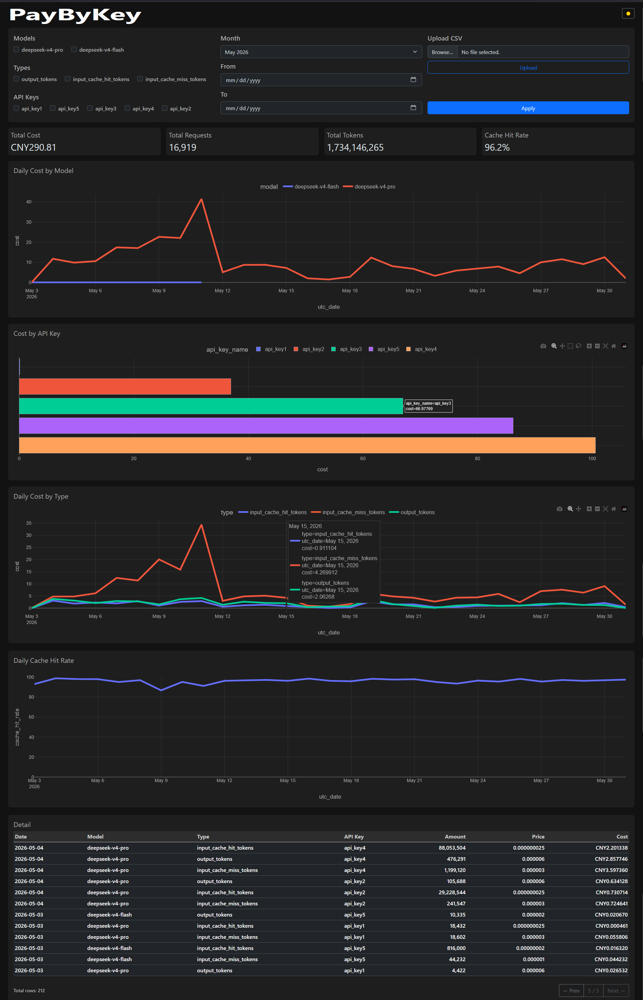

# PayByKey — DeepSeek API Cost Dashboard

## Why

The official DeepSeek dashboard shows total spending but **not per API key**. If you have 5 keys for different projects or team members, you can't tell which one drains the budget.

PayByKey answers that question.



[](https://github.com/Hermitation1/PayByKey/actions)
[](https://github.com/Hermitation1/PayByKey)
[](https://www.python.org/)


## Features

- **KPI cards** — total cost, requests, tokens, cache hit rate
- **4 charts** — cost by model, by API key, by token type, cache hit rate trend
- **Detail table** — line-by-line breakdown with pagination and filtering
- **Filters** — month, date range, model, type, API key
- **All Time mode** — merge all monthly CSV files into one report
- **CSV upload** — via web interface
- **Dark/light theme** — smooth CSS transition, no page reload
- **Rate limiting** — `/upload` protected from abuse

## Tech stack

| Layer | Tool |
|-------|------|
| Backend | FastAPI + Uvicorn |
| Data | Pandas |
| Charts | Plotly |
| Templates | Jinja2 |
| Frontend | Bootstrap 5 + vanilla JS |
| Deployment | Docker + uv |

## Under the hood

```
DeepSeek CSV → data_loader.py (Pandas) → charts.py (Plotly) → app.py (FastAPI)
                                                    ↓
                                          /api/dashboard (JSON)
                                                    ↓
                                          dashboard.html (AJAX)
```

1. **`data_loader.py`** — `preprocess()` cleans CSV, adds cost column, drops zeros & NaN. `apply_filters()` builds boolean mask. `get_total_metrics()` computes KPI, `get_daily_cache_hit_rate()` via `pivot_table`.
2. **`charts.py`** — builds Plotly charts with manual theme control (background colors, grid, legend). Returns HTML fragments.
3. **`app.py`** — two endpoints: `/` (server render) and `/api/dashboard` (AJAX JSON). Single helper function shared by both.
4. **AJAX + AbortController** — previous fetch cancelled on rapid theme/filter changes, new charts fade in (CSS opacity transition).

## Quick start

```bash
# Local
uv sync
uv run uvicorn app:app --host 0.0.0.0 --port 8000

# Docker
docker build -t paybykey .
docker run -p 8000:8000 paybykey
```

Open http://localhost:8000. Upload CSV via the **Upload** button or drop files into `data/`.

### Getting CSV from DeepSeek

1. Log in at [platform.deepseek.com](https://platform.deepseek.com)
2. Go to **Usage** → select month → click **Export**
3. Unzip the downloaded package
4. Use the **`amount`** CSV file (contains per-key breakdown)

---

If this project helps you, I'd appreciate a ⭐ star! Open to suggestions and contributions.

---

## Почему

Официальный дашборд DeepSeek показывает общие расходы, но **не по API-ключам**. Если у вас 5 ключей для разных проектов или сотрудников — непонятно, какой из них тратит бюджет.

PayByKey отвечает на этот вопрос.

## Возможности

- **KPI-карточки** — общая стоимость, запросы, токены, cache hit rate
- **4 графика** — стоимость по моделям, по ключам, по типам токенов, динамика cache hit rate
- **Детальная таблица** — построчная расшифровка с пагинацией и фильтрацией
- **Фильтры** — месяц, диапазон дат, модель, тип, API-ключ
- **Режим All Time** — склеивание всех CSV в один отчёт
- **Загрузка CSV** — через веб-интерфейс
- **Тёмная/светлая тема** — плавная CSS-анимация, без перезагрузки
- **Rate limiting** — защита `/upload` от злоупотребления

## Технологический стек

| Слой | Инструмент |
|------|-----------|
| Бэкенд | FastAPI + Uvicorn |
| Данные | Pandas |
| Графики | Plotly |
| Шаблоны | Jinja2 |
| Фронтенд | Bootstrap 5 + vanilla JS |
| Запуск | Docker + uv |

## Под капотом

```
CSV DeepSeek → data_loader.py (Pandas) → charts.py (Plotly) → app.py (FastAPI)
                                                    ↓
                                          /api/dashboard (JSON)
                                                    ↓
                                          dashboard.html (AJAX)
```

1. **`data_loader.py`** — `preprocess()` чистит CSV, добавляет колонку cost, удаляет нули и NaN. `apply_filters()` строит boolean mask. `get_total_metrics()` считает KPI, `get_daily_cache_hit_rate()` через `pivot_table`.
2. **`charts.py`** — строит Plotly-графики с ручной настройкой темы (цвет фона, сетка, легенда). Возвращает HTML-фрагменты.
3. **`app.py`** — два эндпоинта: `/` (серверный рендеринг) и `/api/dashboard` (JSON для AJAX). Один хелпер на оба.
4. **AJAX + AbortController** — при быстрой смене темы или фильтров предыдущий fetch отменяется, новые графики появляются плавно (CSS opacity transition).

## Быстрый старт

```bash
# Локально
uv sync
uv run uvicorn app:app --host 0.0.0.0 --port 8000

# Docker
docker build -t paybykey .
docker run -p 8000:8000 paybykey
```

Открыть http://localhost:8000. CSV загружается кнопкой **Upload** в интерфейсе или в папку `data/`.

### Как получить CSV из DeepSeek

1. Войти на [platform.deepseek.com](https://platform.deepseek.com)
2. **Usage** → выбрать месяц → **Export**
3. Распаковать архив
4. Нужен файл **`amount`** (содержит разбивку по ключам)

---

Если проект оказался полезным — поставьте ⭐! Открыт к предложениям и доработкам.

